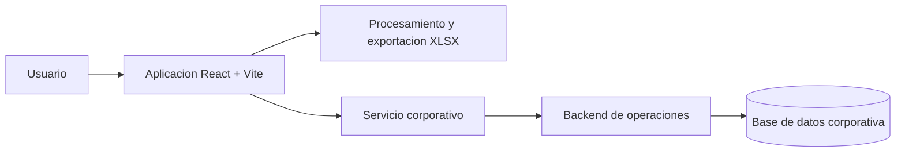

# Proyecto One

Aplicacion web interna para la operacion y seguimiento de cuentas. Permite preparar archivos de trabajo, verificar identificadores, actualizar status, gestionar devoluciones y generar reportes Excel. El frontend esta construido con React y Vite y se conecta al backend corporativo mediante una configuracion externa cuando se ejecuta en produccion.

## Caracteristicas

- Carga de uno o varios archivos `.xlsx` o `.xls`.
- Seleccion de una columna para simular la verificacion de cuentas.
- Busqueda manual de identificadores.
- Renombrado de archivos con cliente, fecha, remitente, tipo de pago, suscripcion y hora.
- Exportacion de resultados a Excel desde el navegador.
- Modulos de cambio de status y devoluciones.
- Modo demo opcional para revisar la interfaz sin servidor ni datos reales.
- Configuracion de la conexion externa mediante variables de entorno.

## Tecnologia

- React 19, React Router y Vite.
- SheetJS (`xlsx`) para leer y generar hojas de calculo localmente.
- ESLint para validacion de codigo.
- Node.js 20 o superior y npm.

## Arquitectura



## Puesta en marcha

1. Instala Node.js 20 o superior.
2. Instala dependencias:

   ```bash
   npm install
   ```

3. Inicia el entorno local:

   ```bash
   npm run dev
   ```

4. Abre la URL que muestra Vite, normalmente `http://localhost:5173`.

## Rutas del frontend

Estas rutas pertenecen a la aplicacion React y son seguras para documentar y compartir:

| Ruta                   | Modulo                  | Funcion                                                |
| ---------------------- | ----------------------- | ------------------------------------------------------ |
| `/`                    | Verificacion de cuentas | Entrada principal de la aplicacion.                    |
| `/proyect-one`         | Verificacion de cuentas | Carga, analisis, renombrado y exportacion de archivos. |
| `/leyendas`            | Leyendas                | Consulta de leyendas y referencias operativas.         |
| `/status`              | Actualizacion de status | Preparacion y consulta de cambios de status.           |
| `/devoluciones`        | Devoluciones            | Carga y procesamiento de archivos de devoluciones.     |
| `/plantillas-whatsapp` | Plantillas WhatsApp     | Consulta y uso de mensajes operativos.                 |

## Modo demo

El modo demo esta activado por defecto. Permite revisar la experiencia del frontend sin conectarse al servicio corporativo. Tambien puedes dejarlo explicito definiendo `VITE_DEMO_MODE=true` en `.env`:

```dotenv
VITE_DEMO_MODE=true
```

En este modo:

- Las verificaciones usan datos ficticios generados en el navegador.
- Status y devoluciones muestran resultados simulados.
- La accion de borrar indica que no se realizaron cambios.
- No se envian identificadores, archivos ni informacion del navegador a ningun servidor.

Para activar la conexion real, elimina `VITE_DEMO_MODE` o establece su valor en `false` y configura la URL del servicio en el entorno de despliegue. El servicio y sus credenciales deben administrarse fuera de este repositorio.

## Scripts

| Comando           | Descripcion                                 |
| ----------------- | ------------------------------------------- |
| `npm run dev`     | Inicia el servidor de desarrollo.           |
| `npm run build`   | Genera la version de produccion en `dist/`. |
| `npm run preview` | Sirve localmente la compilacion.            |
| `npm run start`   | Sirve la compilacion de produccion.         |
| `npm run lint`    | Ejecuta ESLint.                             |

## Estructura

```text
.
├── public/                 # Recursos estaticos
├── src/
│   ├── components/         # Leyendas, status, devoluciones y plantillas
│   ├── App.jsx             # Flujo principal de carga y exportacion
│   ├── config.js           # Modo demo y datos simulados
│   ├── App.css
│   ├── index.css
│   └── main.jsx
├── .env.example            # Configuracion segura de ejemplo
├── .gitignore
├── index.html
├── package.json
└── vite.config.js
```

## Seguridad y privacidad

- El repositorio no contiene credenciales, contrasenas, tokens ni conexiones a redes privadas.
- Los archivos seleccionados se procesan en memoria del navegador y no se suben durante el modo demo.
- Los archivos `.env` estan excluidos de Git; solo `.env.example` debe versionarse.
- Antes de publicar, revisa tambien el historial de Git y rota cualquier credencial que haya sido expuesta anteriormente.
- El backend real debe vivir separado, mantener sus secretos fuera del frontend y aplicar controles de acceso antes de habilitar `VITE_DEMO_MODE=false`.

## Licencia

© 2026 Ian Marcel Castrejon Cuevas. Todos los derechos reservados.

Este proyecto y su código fuente son propiedad de Ian Marcel Castrejon Cuevas. Queda prohibida la reproducción, distribución, modificación o utilización del código, total o parcialmente, sin autorización previa del propietario.
